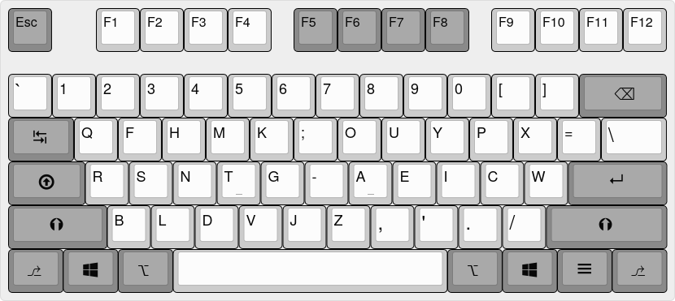
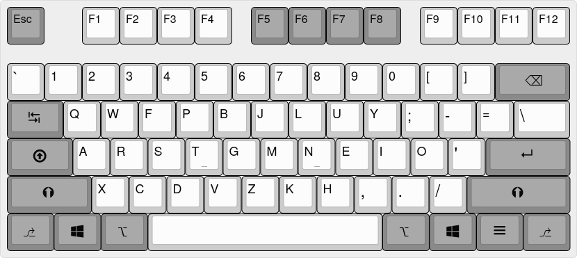
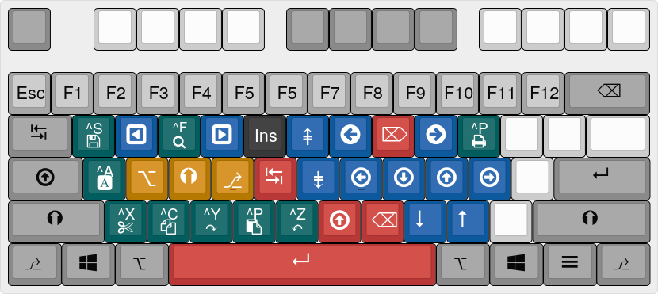
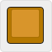
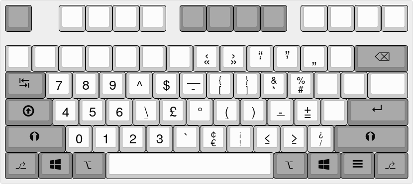

<h1 align="center">AutoHotkey v2 Keyboard Tweaks</h1>

# 1. Description

This is a repository where I collect some of the keyboard focused tweaks and tricks I've implemented in AutoHotkey (‘AHK’ for short) script. Also, I generally use AHK to emulate my keyboard layout at work where I'm not allowed to install programs or run software with administrator privileges (company policy).

There are some work related scripts which I cannot share and they are purposefully left out. I take care to not leave any such code in my scripts, but let me know or create a pull request if I miss something.

**Disclaimer:** My scripts primarily target AutoHotkey version 2, so while it may be possible to run them on version 1, you may experience unexpected results or erratic script behaviour when doing so.

# 2. Keyboard Layouts

These keyboard layout implementations are achieved by programming AutoHotkey to remap Windows keyboard layout's VirtualKeys. The keys are only moved on the keyboard, but they still follow the active host layout's punctuation marks, Shift , AltGr, and AltGr+Shift key maps. Examples:

* If the Windows keyboard layout is US QWERTY, <kbd>AltGr+S</kbd> produces nothing

* If the Windows keyboard layout is Polish (Programmers), <kbd>AltGr+S</kbd> produces ś

* If the Windows keyboard layout is Dutch (QWERTY), <kbd>AltGr+S</kbd> produces ß

It is important to mention that some characters of the host layout located on the ISO 102 key are lost on ANSI boards; therefore, it is cardinal to always select the correct layout type for your keyboard as ANSI and ISO layouts send different [VirtualKey codes](https://docs.microsoft.com/en-us/windows/win32/inputdev/virtual-key-codes).

Please note, such VirtualKey-based alternative keyboard layout remaps prevent you from using hotstrings with AutoHotkey, e.g. typing ‘ btw’ outputs *by the way*.

## 2.1 UMOS

UMOS stands for *UCIEA Mirrored (&) Ory's Symbols*. This layout is a mirrored version of Ian Doug's original UCIEA keyboard layout which has also gone through several versions and modifications.

**Keyboard Layout Authorship**:  
**Author:** Ian Doug <ian@keyboard-design.com>  
**URL:** https://keyboard-design.com/letterlayout.html?layout=uciea-keyboard.en.ansi

The image below showcases the keyboard layout for ANSI 101/104-key keyboards.



## 2.2 Colemak-DH

Colemak-DH is an improvement over the standard Colemak keyboard layout by replacing the D and H keys thus reducing lateral movement of the index fingers.

**Keyboard Layout Authorship:**  
**Author:** stevep99  
**URL:** https://colemakmods.github.io/mod-dh/

Please note, I've moved the symbol keys (<kbd>[</kbd> <kbd>]</kbd> <kbd>=</kbd> etc.) to personally better positions for easier access.

The image below showcases the keyboard layout for ANSI 101/104-key keyboards.



# 3. Tweaks

## Implemented

- [x] Swap <kbd>Caps Lock</kbd> with <kbd>RCtrl</kbd> 
- [x] Add Colemak-DH keyboard layout
- [x] Optimise key remapping when CPU speed is slow (CPU is downclocked, notebook is running from battery or other performance downgrading features are enabled). Remapped keyboard layout keys are sometimes note emitted or ignored when Windows performance plan is not set to High Performance or Balanced, or the CPU is not running fast enough.
- [x] Extend layer
- [x] Symbol layer

## To Do

(to be decided)

## 3.1 Extend Layer

‘Extend’ is a special layer that is dedicated for extra functionality of your keyboard (or other peripherals with user input capabilities). It is activated by its own key to provide text editing and navigation functions on the alphanumeric keys without having to move your hands away from their home positions.

This implemention was inspired by stevep99's and Øystein "DreymaR" Bech-Aase's. The code is a fork of stevep99's (https://github.com/stevep99) Extend layer implementation in AutoHotkey for Colemak-DH.

**To activate the Extend layer:** Press and hold the Extend key (<kbd>Caps Lock</kbd>) then press another alphanumeric key.

**To modify the Extend layer activation key:**

1. Navigate to `..\Keyboard\Tweaks\extend_layer.ahk`.
2. Change the key name at `CapsLock::F24`; e.g. change <kbd>Caps Lock</kbd> to <kbd>LAlt</kbd>.
3. Save your changes.
4. Reload AutoHotkey.

The image below showcases the Extend layer for ANSI 101/104-key keyboards.



| ***Key Legends*** |  |  |
| :--- | :--- | :--- |
| **Colour** | **Type** | **Comments** |
|  | Navigation | Includes: <kbd>Back</kbd> <kbd>Forward</kbd> <kbd>PgUp</kbd> <kbd>PgDn</kbd> <kbd>Home</kbd> <kbd>End</kbd> <kbd>Left</kbd> <kbd>Down</kbd> <kbd>Up</kbd> <kbd>Right</kbd> <kbd>Mouse Wheel Scroll Down</kbd> <kbd>Mouse Wheel Scroll Up</kbd> |
|  | Text Editing | Includes: <kbd>Delete</kbd> <kbd>Tab</kbd> <kbd>Caps Lock</kbd> <kbd>Backspace</kbd> <kbd>Enter</kbd> |
|  | Modifiers | Includes: <kbd>Alt</kbd> <kbd>Shift</kbd> <kbd>Ctrl</kbd> |
|  | Ctrl Shortcuts | Includes: <kbd>Ctrl+S</kbd> save <kbd>Ctrl+F</kbd> find <kbd>Ctrl+P</kbd> print <kbd>Ctrl+A</kbd> select all <kbd>Ctrl+X</kbd> cut <kbd>Ctrl+C</kbd> copy <kbd>Ctrl+V</kbd> paste <kbd>Ctrl+Z</kbd> undo <kbd>Ctrl+Y</kbd> redo |
|  | F* Keys | Keys from the function row |
|  | Unassigned | No mapped function |

## 3.2 Symbol Layer

The Symbol layer adds a special layer dedicated for easier symbol and digit access. This implemention was inspired by stevep99's ‘AltGr Programmer’ extension (https://github.com/stevep99).

**To activate the Symbol layer:** Press and hold the Symbol key (<kbd>Alt</kbd>) then press another alphanumeric key.

**To modify the Symbol layer activation key:**

1. Navigate to `..\Keyboard\Tweaks\symbol_layer.ahk`.
2. Change the key name at `LAlt::F23`; e.g. change <kbd>Alt</kbd> to <kbd>Caps Lock</kbd>.
3. Save your changes.
4. Reload AutoHotkey.

The image below showcases the Symbol layer for ANSI 101/104-key keyboards.



# 4. File and Directory Overview

```
../
├── main.ahk
├── Keyboard/
│   ├── Layouts/
│   └── Tweaks/
├── LICENSE
├── README.md
└── Assets/
```
| ***Project Files*** |  |  |
| :--- | :--- | :--- |
| **File name** | **Description** | **Comments** |
| `main.ahk` | Core script | Configures the general behaviour of AutoHotkey, how the scripts are run, and loads subsequent scripts. |
| `Keyboard/Layouts` | Keyboard layout scripts | UMOS, Colemak-DH, AZERTY, what have you... |
| `Keyboard/Tweaks` | Keyboard functions | Code snippets to extend or change the keyboard's capabilities.  |
| `Assets` | Miscellaneous data files | These files aren't used or detected by AutoHotkey. The keyboard layout image files were created using [Keyboard Layout Editor](http://keyboard-layout-editor.com). |

# 5. Licenses and Forking

This project is generally licensed under MIT License (also known simply as ‘MIT’) with the following exception:

* All content of `Assets` are Public Domain.

The project files may be forked according to their license guidelines.